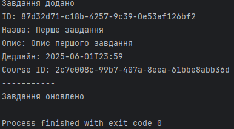
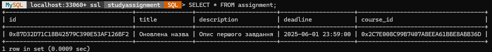

# Проєкт DAO для таблиці Assignment

## Опис

Цей проєкт демонструє просту реалізацію DAO (Data Access Object) для роботи з таблицею `assignment` у базі даних MySQL. Реалізовані базові CRUD-операції: створення, читання, оновлення та видалення записів.

---

## 1. SQL скрипт створення бази даних і таблиці

```sql
CREATE DATABASE IF NOT EXISTS edu_management;
USE edu_management;

CREATE TABLE IF NOT EXISTS assignment (
    id BINARY(16) PRIMARY KEY,
    title VARCHAR(100) NOT NULL,
    description TEXT,
    deadline DATETIME,
    course_id BINARY(16)
);
```

**Пояснення:**
- Створюємо базу `edu_management` (якщо не існує).
- Створюємо таблицю `assignment` з полями:
  - `id` — унікальний ідентифікатор (UUID зберігається як `BINARY(16)` для компактності).
  - `title` — назва завдання.
  - `description` — опис завдання.
  - `deadline` — дедлайн у форматі дати та часу.
  - `course_id` — зовнішній ключ на курс.

---

## 2. Клас-модель Assignment.java

```java
package com.example.model;

import java.util.UUID;
import java.time.LocalDateTime;

public class Assignment {
    private UUID id;
    private String title;
    private String description;
    private LocalDateTime deadline;
    private UUID courseId;

    public Assignment() {}

    public Assignment(UUID id, String title, String description, LocalDateTime deadline, UUID courseId) {
        this.id = id;
        this.title = title;
        this.description = description;
        this.deadline = deadline;
        this.courseId = courseId;
    }

    public UUID getId() { return id; }
    public void setId(UUID id) { this.id = id; }

    public String getTitle() { return title; }
    public void setTitle(String title) { this.title = title; }

    public String getDescription() { return description; }
    public void setDescription(String description) { this.description = description; }

    public LocalDateTime getDeadline() { return deadline; }
    public void setDeadline(LocalDateTime deadline) { this.deadline = deadline; }

    public UUID getCourseId() { return courseId; }
    public void setCourseId(UUID courseId) { this.courseId = courseId; }
}
```

---

## 3. Інтерфейс DAO AssignmentDAO.java

```java
package com.example.dao;

import com.example.model.Assignment;
import java.util.List;
import java.util.UUID;

public interface AssignmentDAO {
    void addAssignment(Assignment assignment);
    Assignment getAssignmentById(UUID id);
    List<Assignment> getAllAssignments();
    void updateAssignment(Assignment assignment);
    void deleteAssignment(UUID id);
}
```

---

## 4. Реалізація DAO AssignmentDAOImpl.java

```java
package com.example.dao;

import com.example.model.Assignment;
import com.example.util.DBConnection;

import java.sql.*;
import java.nio.ByteBuffer;
import java.time.LocalDateTime;
import java.util.*;

public class AssignmentDAOImpl implements AssignmentDAO {
    private final Connection conn = DBConnection.getConnection();

    private UUID bytesToUUID(byte[] bytes) {
        ByteBuffer bb = ByteBuffer.wrap(bytes);
        long high = bb.getLong();
        long low = bb.getLong();
        return new UUID(high, low);
    }

    private byte[] uuidToBytes(UUID uuid) {
        ByteBuffer bb = ByteBuffer.allocate(16);
        bb.putLong(uuid.getMostSignificantBits());
        bb.putLong(uuid.getLeastSignificantBits());
        return bb.array();
    }

    @Override
    public void addAssignment(Assignment assignment) {
        String sql = "INSERT INTO assignment (id, title, description, deadline, course_id) VALUES (?, ?, ?, ?, ?)";
        try (PreparedStatement ps = conn.prepareStatement(sql)) {
            ps.setBytes(1, uuidToBytes(assignment.getId()));
            ps.setString(2, assignment.getTitle());
            ps.setString(3, assignment.getDescription());
            ps.setTimestamp(4, assignment.getDeadline() != null ? Timestamp.valueOf(assignment.getDeadline()) : null);
            ps.setBytes(5, uuidToBytes(assignment.getCourseId()));
            ps.executeUpdate();
        } catch (SQLException e) {
            e.printStackTrace();
        }
    }

    @Override
    public Assignment getAssignmentById(UUID id) {
        String sql = "SELECT * FROM assignment WHERE id = ?";
        try (PreparedStatement ps = conn.prepareStatement(sql)) {
            ps.setBytes(1, uuidToBytes(id));
            ResultSet rs = ps.executeQuery();
            if (rs.next()) {
                return new Assignment(
                    bytesToUUID(rs.getBytes("id")),
                    rs.getString("title"),
                    rs.getString("description"),
                    rs.getTimestamp("deadline") != null ? rs.getTimestamp("deadline").toLocalDateTime() : null,
                    bytesToUUID(rs.getBytes("course_id"))
                );
            }
        } catch (SQLException e) {
            e.printStackTrace();
        }
        return null;
    }

    @Override
    public List<Assignment> getAllAssignments() {
        List<Assignment> assignments = new ArrayList<>();
        String sql = "SELECT * FROM assignment";
        try (Statement st = conn.createStatement()) {
            ResultSet rs = st.executeQuery(sql);
            while (rs.next()) {
                assignments.add(new Assignment(
                    bytesToUUID(rs.getBytes("id")),
                    rs.getString("title"),
                    rs.getString("description"),
                    rs.getTimestamp("deadline") != null ? rs.getTimestamp("deadline").toLocalDateTime() : null,
                    bytesToUUID(rs.getBytes("course_id"))
                ));
            }
        } catch (SQLException e) {
            e.printStackTrace();
        }
        return assignments;
    }

    @Override
    public void updateAssignment(Assignment assignment) {
        String sql = "UPDATE assignment SET title = ?, description = ?, deadline = ?, course_id = ? WHERE id = ?";
        try (PreparedStatement ps = conn.prepareStatement(sql)) {
            ps.setString(1, assignment.getTitle());
            ps.setString(2, assignment.getDescription());
            ps.setTimestamp(3, assignment.getDeadline() != null ? Timestamp.valueOf(assignment.getDeadline()) : null);
            ps.setBytes(4, uuidToBytes(assignment.getCourseId()));
            ps.setBytes(5, uuidToBytes(assignment.getId()));
            ps.executeUpdate();
        } catch (SQLException e) {
            e.printStackTrace();
        }
    }

    @Override
    public void deleteAssignment(UUID id) {
        String sql = "DELETE FROM assignment WHERE id = ?";
        try (PreparedStatement ps = conn.prepareStatement(sql)) {
            ps.setBytes(1, uuidToBytes(id));
            ps.executeUpdate();
        } catch (SQLException e) {
            e.printStackTrace();
        }
    }
}
```

---

## 5. Клас для підключення до БД DBConnection.java

```java
package com.example.util;

import java.sql.Connection;
import java.sql.DriverManager;
import java.sql.SQLException;

public class DBConnection {
    private static Connection connection;

    public static Connection getConnection() {
        if (connection == null) {
            try {
                connection = DriverManager.getConnection(
                    "jdbc:mysql://localhost:3306/studyassignment",
                    "root",
                    "password"
                );
            } catch (SQLException e) {
                e.printStackTrace();
            }
        }
        return connection;
    }
}
```

---

## 6. Тестовий клас Main.java

```java
package com.example;

import com.example.dao.AssignmentDAO;
import com.example.dao.AssignmentDAOImpl;
import com.example.model.Assignment;

import java.time.LocalDateTime;
import java.util.List;
import java.util.UUID;

public class Main {
    public static void main(String[] args) {
        AssignmentDAO assignmentDAO = new AssignmentDAOImpl();

        UUID assignmentId = UUID.randomUUID();
        UUID dummyCourseId = UUID.randomUUID();

        Assignment assignment = new Assignment(
            assignmentId,
            "Перше завдання",
            "Опис першого завдання",
            LocalDateTime.of(2025, 6, 1, 23, 59),
            dummyCourseId
        );

        assignmentDAO.addAssignment(assignment);
        System.out.println("Завдання додано");

        List<Assignment> assignments = assignmentDAO.getAllAssignments();
        for (Assignment a : assignments) {
            System.out.println("ID: " + a.getId());
            System.out.println("Назва: " + a.getTitle());
            System.out.println("Опис: " + a.getDescription());
            System.out.println("Дедлайн: " + a.getDeadline());
            System.out.println("Course ID: " + a.getCourseId());
            System.out.println("-----------");
        }

        assignment.setTitle("Оновлена назва");
        assignmentDAO.updateAssignment(assignment);
        System.out.println("Завдання оновлено");

        assignmentDAO.deleteAssignment(assignmentId);
        System.out.println("Завдання видалено");
    }
}
```

---

## Місце для скріншотів роботи

Створення завдання

Результат створення завдання


---

## Висновок

Реалізована проста структура DAO дозволяє працювати з таблицею `assignment` у базі даних MySQL через Java. Використання UUID у форматі `BINARY(16)` забезпечує компактне і унікальне ідентифікування записів. CRUD-методи надають базовий функціонал для додавання, читання, оновлення та видалення завдань. Цей шаблон можна розширювати для інших таблиць і функцій у системі управління навчальним процесом.
