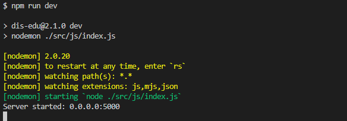
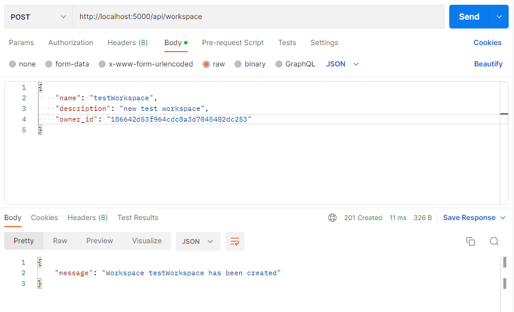
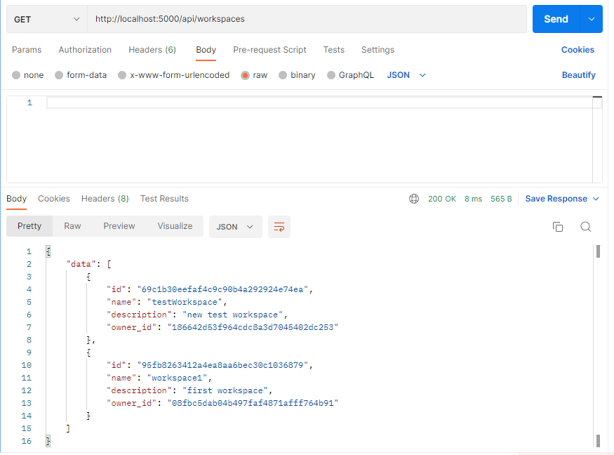
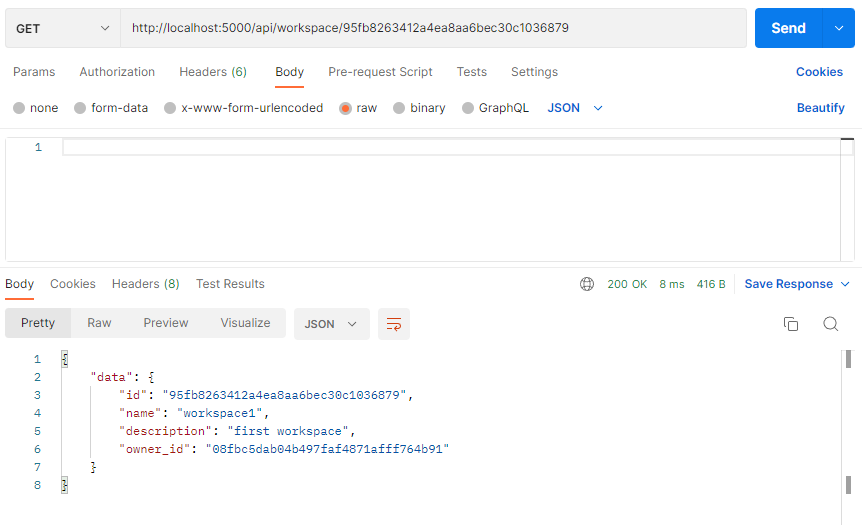
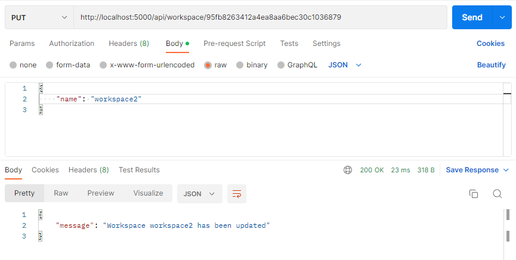
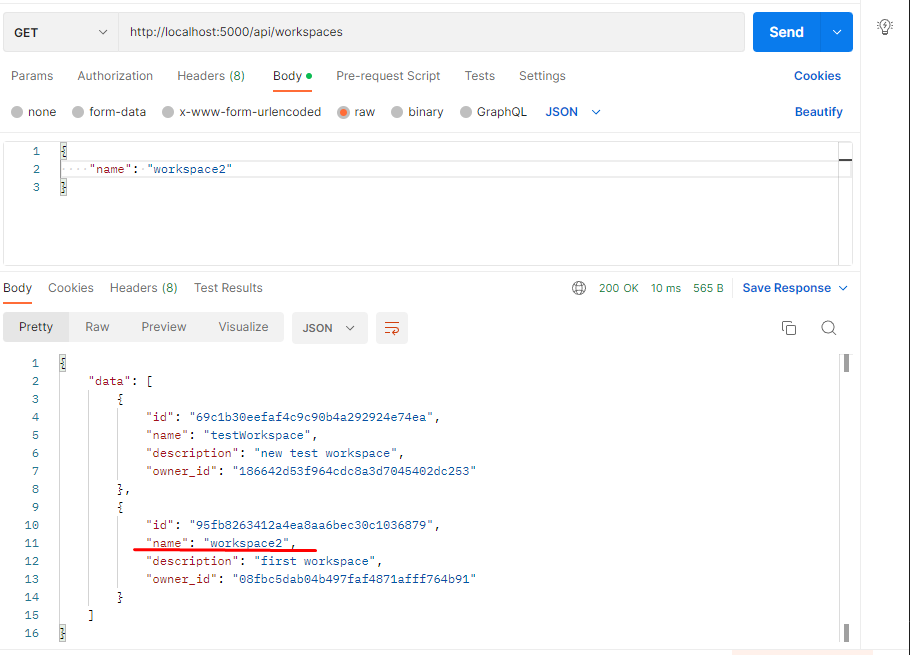
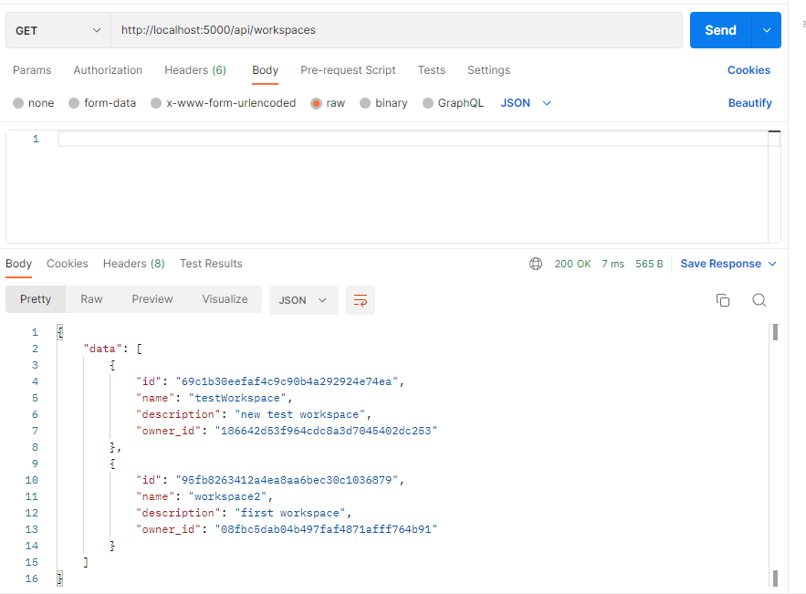
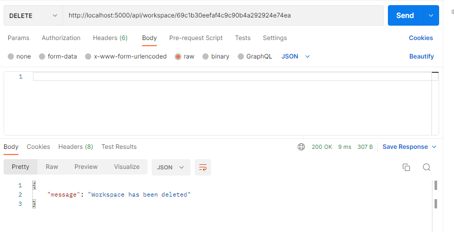
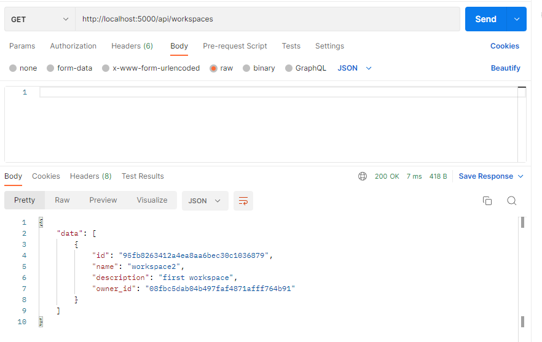

# Тестування працездатності системи

*В цьому розділі необхідно вказати засоби тестування, навести вихідні коди тестів та результати тестування.*

## Запуск сервера на 5000 порті

## Додавання сутності (Create)

### Запит

### Результат (і відображення усіх сутностей)

## Читання сутності (Read)

### Результат

## Оновлення сутності (Update)

### Запит

### Результат

## Видалення сутності (Delete)

### До видалення

### Запит

### Результат

